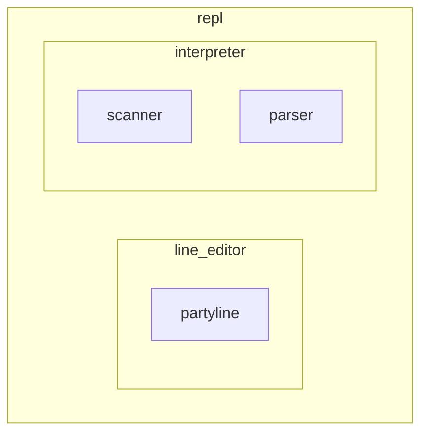

# 🐢 tinyshell

Experimental shell for learning purposes only. Goal is to implement as much of [POSIX sh](https://pubs.opengroup.org/onlinepubs/9699919799/utilities/V3_chap02.html) as I can until I'm no longer interested in the project.

## Install

```sh
git clone --recursive https://github.com/mharrisb1/tinyshell.git
cd tinyshell
make
make install
```

In a new terminal session/window initialize the shell with `tiny` command:

```sh
tiny
```

## Uninstall

```sh
make uninstall
make clean
```

## Usage

```
$ tiny
  _____     ____     ______
 /      \  |  o |   | sup. |
|        |/ ___\|  /_______|
|_________/
|_|_| |_|_|

>
```

The line editor used is [partyline](https://github.com/mharrisb1/partyline). See the documentation in that repo for keybindings.

## Architecture



## Progress

### 2025-05-05

- First pass implementation of the parser

### 2025-05-02

- Integrated my own custom line editor, [partyline](https://github.com/mharrisb1/partyline)
- Circling back to the parser for the interpreter implementation

### 2025-04-21

- Working on finishing the implementation of the interpreter
- Currently supports a subset of the sh grammar
  - Mainly missing scripting grammars
