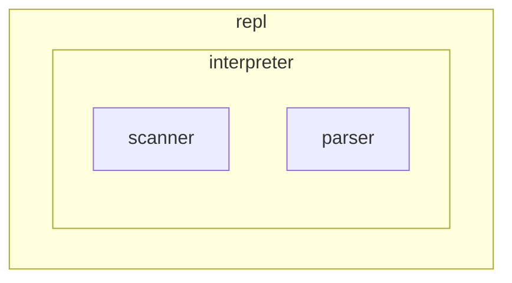

# 🐢 tinyshell

Experimental shell for learning purposes only. Goal is to implement as much of [POSIX sh](https://pubs.opengroup.org/onlinepubs/9699919799/utilities/V3_chap02.html) as I can until I'm no longer interested in the project.

## Usage

```
$ tiny
  _____     ____     ______
 /      \  |  o |   | sup. |
|        |/ ___\|  /_______|
|_________/
|_|_| |_|_|

>
```

## Architecture



## Progress

### 2025-04-21

- Working on finishing the implementation of the interpreter
- Currently supports a subset of the sh grammar
  - Mainly missing scripting grammars
